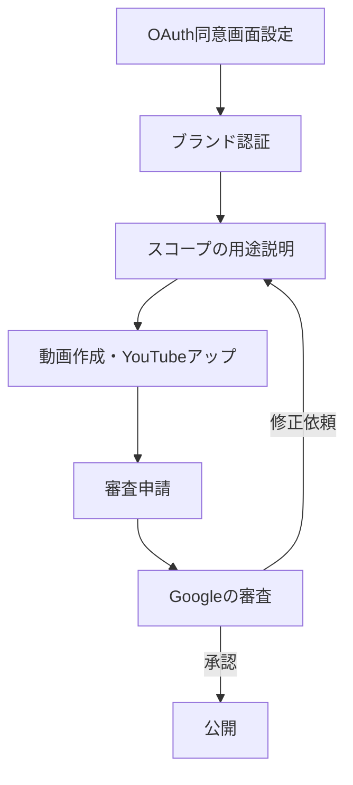

Google Calendar APIを使ったアプリを公開し、多くのユーザーに使ってもらうための**OAuthアプリ承認（Verification）手順**をまとめました。

---

# ■ 承認が必要なケース
- 100人以上のユーザーに使わせたい
- **Sensitive**や**Restricted**スコープ（Google Calendarの読み書きなど）を使う場合

---

# ■ 必要な準備

### 1. ブランド認証
- **公式サイト**（認証済みドメイン）を用意し、OAuth同意画面に登録
- **プライバシーポリシー**を作成し、サイトに掲載
- **Google Search Console**でドメイン所有権を確認
- **Googleのブランドガイドライン**に沿ったUIにする

### 2. スコープの説明
- **なぜそのスコープが必要か**を詳細に説明
- **最小限のスコープのみ**申請

### 3. アプリの動作説明動画
- **OAuth認証の流れを最初から最後まで録画**
- **OAuth同意画面は英語表示に設定**
- **アプリ名・OAuthクライアントIDが見えるように**
- **認証後にカレンダーのデータをどう使うかを実演**
- **YouTubeに限定公開でアップし、URLを申請**

---

# ■ 承認申請の流れ

---

# ■ 補足
- restrictedスコープは**年1回のセキュリティ監査（有料）**が必要
- 100人未満のテスト用途なら審査不要（警告画面は出る）
- 社内専用なら「内部」設定で審査不要

---

# ■ 参考リンク
- [OAuth App Verification 公式ヘルプ](https://support.google.com/cloud/answer/13463073?hl=ja)
- [OAuth 2.0 Scopes for Google APIs](https://developers.google.com/identity/protocols/oauth2/scopes)

---

この手順に従い、**ブランド認証＋スコープ説明＋動画提出**を行えば、GoogleのOAuth承認をクリアできます。
